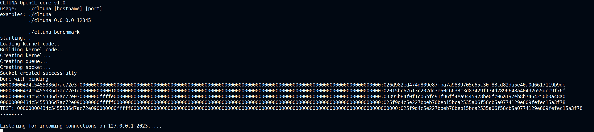
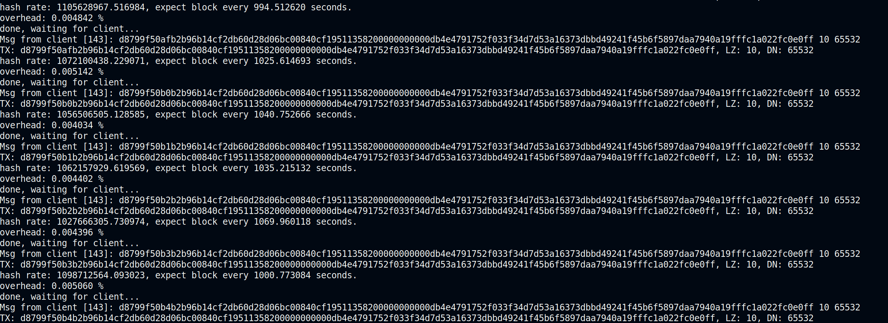

# cltunaminer core
Experimental OpenCL based miner for TUNA

Please keep in mind this is an early experimental version of the miner, please report issues and the hash rates you get with your devices to the issue tracker on Github. 
Let's make it compatible with as many devices and operating systems as possible to improve decentralization!

**this miner core can only calculate hashes, for submitting transactions it needs this fork of the official repo:**
https://github.com/nullhashpixel/fortuna

tips: $gputunaminer 

# Building (Linux)

## 1) Requirements
Only tested on Linux (Ubuntu 20) so far.
NOT compatible with WSL, Windows users please compile it with Visual Studio, see below.

For NVIDIA GPUs, the proprietary graphics driver is needed. On Ubuntu search for "Additional drivers" and select the latest Nvidia version. NOT the line which contains "Nouveau".
After this, run:

    apt update
    apt install build-essential opencl-headers clinfo nvidia-opencl-dev

and then check with

    clinfo

if number of platforms is > 0. (It is 1 in most cases with a single GPU and no special hardware)

## 2) Download the repository

    git clone https://github.com/nullhashpixel/cltunaminer.git
    cd cltunaminer

## 3) Compiling from source

    make

## 4) Running the miner core

    ./cltuna

# Building (Windows)

## 1) Requirements

- Install CUDA Toolkit 12.2 from
  
https://developer.nvidia.com/cuda-downloads?target_os=Windows&target_arch=x86_64&target_version=11&target_type=exe_local

- Install Visual Studio from https://visualstudio.microsoft.com/downloads/

During the installation select "Building C++", no other options. This alone is a 18 GB download.

## 2) Download the repository

If you have git installed, run:

    git clone https://github.com/nullhashpixel/cltunaminer.git
    cd cltunaminer

otherwise you can also just download the repository.

## 3) Create VS project

- Create an empty project (search for "blank solution")
- copy the sha256.h to "Header files", the "sha256.c"+"main.c" to "Source files"
- Right click on your project name in the right panel, select properties
- Add the library and include paths of you CUDA Toolkit installation, the paths are not always exactly the same, but by default look like:

- Library path: C:\Program Files\NVIDIA GPU Computing Toolkit\CUDA\v12.2\lib\x64
- Include path: C:\Program Files\NVIDIA GPU Computing Toolkit\CUDA\v12.2\include

The Library path should contain an "OpenCL.lib"
The include path should contain a folder "CL" with a file "cl.h"

## 4) Compile (green play symbol)

This will create an exe file inside your project directory in a subfolder called Debug or Release

## 5) Copy the executable 

Copy the executable into your `cltunaminer/` directory, where the sha256_opencl.cl is.
Run it from there.


# Start mining with GPU

*To be able to mine, you also need the custom fork of the TypeScript transaction building code from:*
https://github.com/nullhashpixel/fortuna

- Install and compile the miner core, see above steps 1-4

- Install the fortuna code and setup your wallet as described in the fortuna repository
  
- Start the mining core(s): ```./cltuna```

- for automatic restart: run `while true; do ./cltuna; sleep 1; done`
  


- Add the hostname(s) of your miner cores to the **.env** file in the *cltunaminer/* directory of the TypeScript code

Simple example for running with 1 local GPU:
````
MINER_CORE_URLS="127.0.0.1:2023"
````
Running the code on two different machines in your network:
````
MINER_CORE_URLS="192.168.0.100:2023,192.168.0.101:2023"
````

- (in a different terminal window): Start the TypeScript mining script with deno: ```deno task cltunaminer mine```

- check the window of your GPU miner core, it should show you hash rates, estimates for how often solutions are found and the current difficulty


- for automatic restart: run `./run.sh`

# Multi-GPU

- each GPU (or other compatible OpenCL device) needs 1 separate instance of the miner core, each must listen on a different port
  
- to list you devices, run
  
````
    ./cltuna list
````
possible output:
````
device CL_DEVICE_TYPE_GPU: platform 0 device 0, has 128 compute units, 2550 MHz
device CL_DEVICE_TYPE_GPU: platform 0 device 1, has 128 compute units, 2550 MHz
````

- for 1st GPU: `./cltuna 127.0.0.1 2023 0 0`
- for 2nd GPU: `./cltuna 127.0.0.1 2024 0 1`
  
- in your fortuna (deno code) repository, add both to the `.env` file
````
MINER_CORE_URLS="127.0.0.1:2023,127.0.0.1:2024"
````

# Hash rates for GPUs

## >= v1.3

|model   | OS  | hash rate  |
|---|---|---|

|GTX 1060 | Linux | 356 MH/s |
|RTX 2080S   | Linux  | 1.2 GH/s   |
|RTX 3080 Ti | Linux | 1.7 GH/s |
|RTX 4090 | Linux | 4.7 GH/s |

## previous versions

|model   | OS  | hash rate  |
|---|---|---|
|GT 730 | Linux | 20.5MH/s |
|GeForce GTX 1650 Ti (laptop card) | Linux | 356 MH/s |
|RTX 3050 Ti | Linux | 373 MH/s |
|RX580 | Windows | 450MH/s |
|GTX 1070 | Linux | 500 MH/s |
|RTX 3060 TI | Linux/Windows | 980 MH/s |
|RTX 3060 Ti   | Linux  | 970MH/s   |
|RTX A4000   | Linux  |1.0 GH/s   |
|RTX 2080S   | Linux  |1.1GH/s   |
|RTX 3080TI   | Linux  |1.6 GH/s   |
|RTX 3060   | Linux  |1.1 GH/s   |
|RTX 3090   | Linux  |1.8 GH/s   |
|RTX 6000   | Linux  |3.5 GH/s   |
|L40   |   Linux  |3.7 GH/s  |
|RTX 4090   | Linux  |3.8 GH/s   |


# Advanced stuff

## Running the miner core and making it available to outside machines in the network on port 12345

    ./cltuna 0.0.0.0 12345

## Benchmark
Running the benchmark will not wait for connection from the mining script, just computes the hash rate.

    ./cltuna benchmark

## Automatic restart on crashes
If you experience occasional crashes of the miner, consider running it in an infinite loop with a delay.

    while true; do ./cltuna; sleep 1; done


# Changelog

````
v1.2: 23/09/06 fix too low entropy bug
v1.1: 23/09/05 Windows compatibility
v1.0: 23/09/04 initial release
````

# Known bugs/limitations

    - Windows compilation is not as easy as on Linux
    - When using remote Kupo/Ogmios, connection errors and errors due to request limits etc are not all properly handled. Using local instance helps.

# Disclaimer

THE SOFTWARE IS PROVIDED “AS IS”, WITHOUT WARRANTY OF ANY KIND, EXPRESS OR IMPLIED, INCLUDING BUT NOT LIMITED TO THE WARRANTIES OF MERCHANTABILITY, FITNESS FOR A PARTICULAR PURPOSE AND NONINFRINGEMENT. IN NO EVENT SHALL THE AUTHORS OR COPYRIGHT HOLDERS BE LIABLE FOR ANY CLAIM, DAMAGES OR OTHER LIABILITY, WHETHER IN AN ACTION OF CONTRACT, TORT OR OTHERWISE, ARISING FROM, OUT OF OR IN CONNECTION WITH THE SOFTWARE OR THE USE OR OTHER DEALINGS IN THE SOFTWARE.
